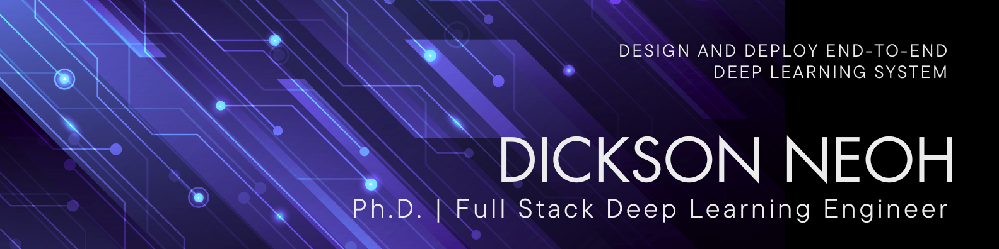

<h3>🚀 I make models small, fast, and efficient. 💨</h3>

     
    <a href="https://dicksonneoh.com" target="_blank" rel="noopener noreferrer"><strong>Explore my webpage »</strong></a>
     
    <a href="https://dicksonneoh.com/portfolio/" target="_blank" rel="noopener noreferrer">Projects</a>
    ·
    <a href="https://dicksonneoh.com/blog" target="_blank" rel="noopener noreferrer">Blog</a>
    ·
    <a href="https://linkedin.com/in/dickson-neoh/" target="_blank" rel="noopener noreferrer">LinkedIn</a>
    .
    <a href="https://x.com/dicksonneoh7" target="_blank" rel="noopener noreferrer">X</a>

## ⭐ Featured Projects

<table>
  <tr>
    <td width="30%">
      
    </td>
    <td width="70%">
      
<a href="https://dicksonneoh.com/portfolio/supercharge_your_pytorch_image_models/" target="_blank" rel="noopener noreferrer">Supercharge Your PyTorch Image Models: Bag of Tricks to 8x Faster Inference with ONNX Runtime & Optimizations.</a>

      
Accelerate inference speed for PyTorch image models using ONNX Runtime and TensorRT optimizations. Achieve up to 123x speedup over the original PyTorch model on CPU.

      
📅 September 30, 2024

    </td>
  </tr>
  <tr>
    <td width="30%">
      
    </td>
    <td width="70%">
      
<a href="https://dicksonneoh.com/portfolio/pytorch_at_the_edge_timm_torchscript_flutter/" target="_blank" rel="noopener noreferrer">PyTorch at the Edge: Deploying Over 964 TIMM Models on Android with TorchScript and Flutter.</a>

      
Deploy PyTorch models on Android using TIMM, Fastai, TorchScript, and Flutter. Select a model from TIMM's 900+ models, train with Fastai, export to TorchScript, and create an Android app with Flutter for inference.

      
📅 February 7, 2023

    </td>
  </tr>
  <tr>
    <td width="30%">
      
    </td>
    <td width="70%">
      
<a href="https://dicksonneoh.com/portfolio/supercharging_yolov5_180_fps_cpu/" target="_blank" rel="noopener noreferrer">Supercharging YOLOv5: How I Got 182.4 FPS Inference Without a GPU.</a>

      
Optimize YOLOv5 model for CPU inference using Neural Magic's SparseML and DeepSparse. Train on custom data, apply sparsification techniques like pruning and quantization, and achieve up to 180+ FPS on a CPU with only 4 cores.

      
📅 June 7, 2022

    </td>
  </tr>
  <tr>
    <td width="30%">
      
    </td>
    <td width="70%">
      
<a href="https://dicksonneoh.com/portfolio/how_to_10x_your_od_model_and_deploy_50fps_cpu/" target="_blank" rel="noopener noreferrer">Faster than GPU: How to 10x your Object Detection Model and Deploy on CPU at 50+ FPS.</a>

      
Optimize a YOLOX object detection model deploy on a CPU. Train with custom data, convert to ONNX and OpenVINO IR formats, and apply post-training quantization. This results in a 10x speed improvement, making real-time inference possible on CPU, even outperforming GPU performance.

      
📅 April 30, 2022

    </td>
  </tr>
</table>

## 🛠️ Tech Stack

Deep Learning Frameworks:

Hyperparameter Optimization:

Experiment Management:

Model Deployment:

Hardware:

Software Engineering:

Data:

Frontend:

## 📞 Connect with me

## ❤️ Support Me
If you find my work helpful, consider supporting me to keep creating valuable content:

